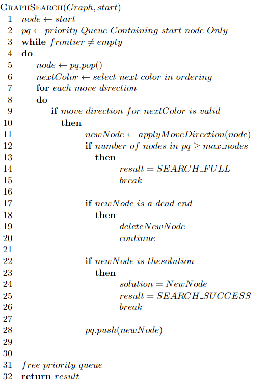

# flow-free-solver
 A simple solver for the Flow-Free game, using Dijkstra's algorithm.

The code in this assignment was adapted from the open-source terminal version made available by <a href="https://github.com/mzucker/flow_solver">mzucker</a>.

The game presents a grid with colored dots occupying some of the squares. The objective is to connect dots of the same color by drawing pipes between them such that the entire grid is occupied by pipes. However, pipes may not intersect. 

Algorithm implemented: 

To execute your solver use the following command: 
`./flow [options]  <puzzleName1> ... <puzzleNameN>`

E.g.  
` ./flow puzzles/regular_5x5_01.txt` 
Will run the solver for the regular 5 by 5 puzzle, and report if the search was successful, the number of nodes generated and the time taken.  
* If you use `flag -q` (quiet) it will report the solutions more concisely (useful if you want to run several puzzles at once and study their performance). 
* If you append the option `-A` it will animate the solution found. 
* If you append the option `-d` it will use the dead-end detection mechanism implemented.

All the options can be found if you use option `-h`: 
<pre>
$./flow -h
usage: flow_solver [ OPTIONS ] BOARD1.txt
BOARD2.txt [ ... ] ]

Display options:

  -q, --quiet             Reduce output
  -d, --diagnostics       Print diagnostics when search unsuccessful
  -A, --animation         Animate solution
  -F, --fast              Speed up animation 4x
  -C, --color             Force use of ANSI color
  -S, --svg               Output final state to SVG

Node evaluation options:

  -d, --deadends          dead-end checking

Color ordering options:

  -r, --randomize         Shuffle order of colors before solving
  -c, --constrained       Disable order by most constrained

Search options:

  -n, --max-nodes N       Restrict storage to N nodes
  -m, --max-storage N     Restrict storage to N MB (default 1024)

Help:

  -h, --help              See this help text
</pre>
